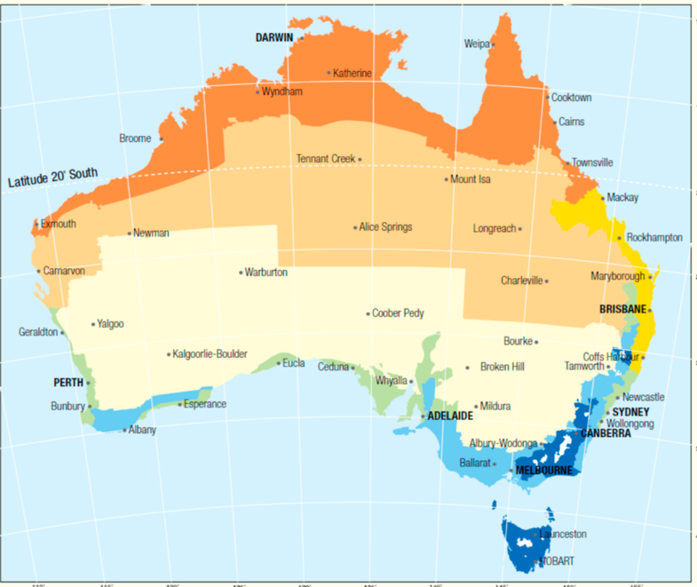
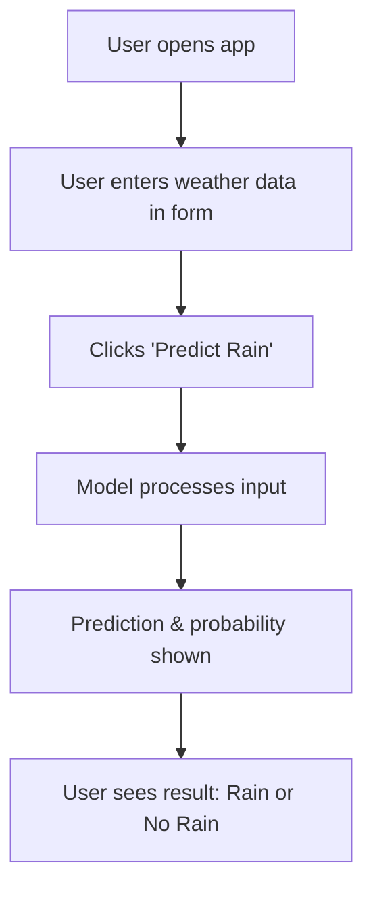

# 🌧️ Rain Forecast in Australia — Streamlit App

This Streamlit app uses a machine learning model to predict whether it will rain tomorrow in Australia, based on user-provided weather data.



---

## Overview

- **Purpose:** Predict if it will rain tomorrow using weather features you enter.
- **Model:** Trained on real Australian weather data (`weatherAUS.csv`).
- **Accuracy:** ~85%.

---

## Quick Start

### 1. Clone the repository

```bash
git clone <your-repo-url>
cd rain_prediction_streamlit_app
```

### 2. Install dependencies

It is recommended to use a virtual environment:

```bash
python -m venv venv
source venv/bin/activate  # or venv\Scripts\activate on Windows
pip install -r requirements.txt
```

### 3. Run the app

```bash
streamlit run app.py
```

### 4. Open the web interface

Open the link shown in your terminal (usually http://localhost:8501).

---

## How to Use

1. Enter weather data in the form (temperature, humidity, wind, etc.).
2. Click the **"🔮 Predict Rain"** button.
3. See the prediction and probability.

---

## App Workflow



---

## Project Structure

- `data/weatherAUS.csv` — (optional) raw data for training/analysis
- `models/aussie_rain.joblib` — saved ML model
- `images/Australian-climate-zones.png` — illustration of climate zones.
- `notebooks/train.ipynb` — main Streamlit app code.
- `requirements.txt` — dependencies.
- `app.py` — main Streamlit app code.

---

## Input Data

- **Numerical:** temperature, humidity, wind speed, etc.
- **Categorical:** location, wind direction, sky condition, etc.
- All required fields are shown in the form.

---

## Important

- The app requires the model file: `models/aussie_rain.joblib`.
- If you want to retrain the model, use `data/weatherAUS.csv` and your own pipeline.


**Author:**  
Tetiana Kravtsova
